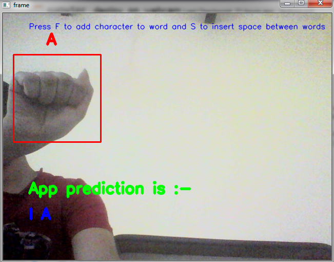
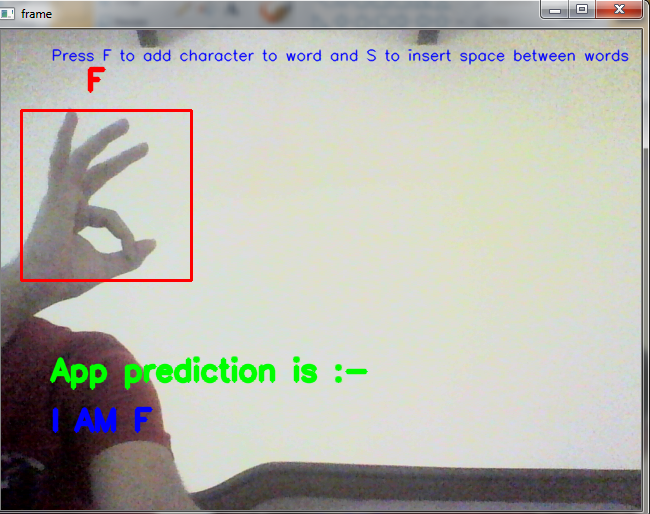

# Sign_language_prediction

<h3> It is a small Deep Learning project to predict the sign language.</h3>

Make any sign in red box and  it will predict the character associated with that sign in sign language.

  

 

If I make the sign of 'A' then it will predict that it is "A" 

 

  

 

  

 

  

