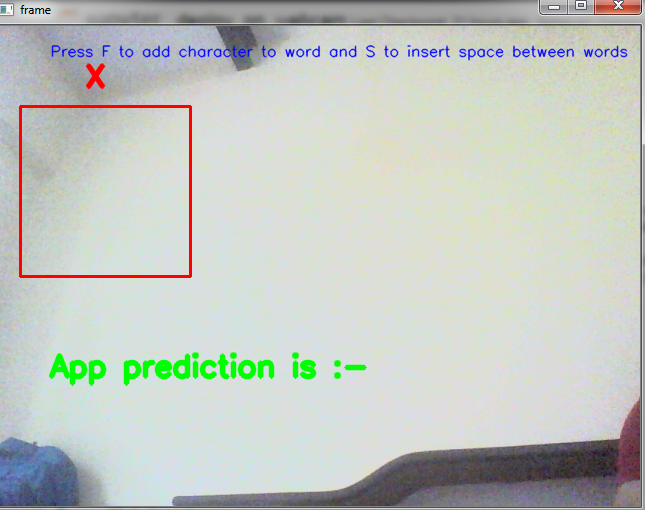
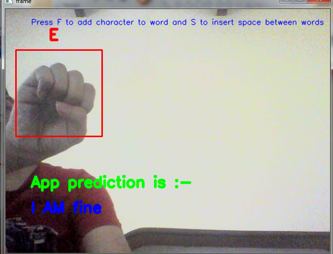

# Sign_language_prediction

<h3> It is a small Deep Learning project to predict the sign language.</h3>
<h2>Dataset link :- https://www.kaggle.com/datamunge/sign-language-mnist </h2>

Note :- It can not predict sign of letter "J" and "Z" beacuse sign of these letter require motion. 

My model is not so good in prediction, it is getting confused between sign of many letters. I trained another model on sign of "A", "E" ,"M" and "S" but it also did not help too much.

Make any sign in red box and  it will predict the character associated with that sign in sign language.

  

 
 

If I make the sign of 'A' then it will predict that it is "A". 

 

  

 
 

Similarly it can predict any sign. 

 

  

 

  

 
 

I am also using Python library named "spellchecker" to check the spelling of a particular word and if it is wrong then it will try to correct it.

